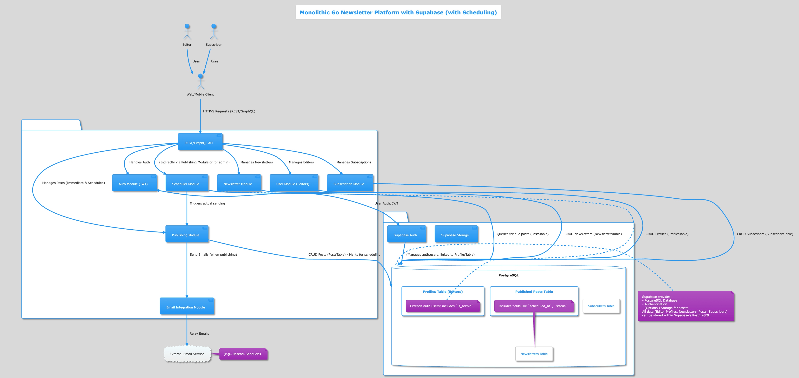

# Monolithic Go Newsletter Platform with Supabase - Architecture Explanation

This document outlines the architecture for the Go Newsletter Platform, employing a monolithic backend design integrated with Supabase for database and authentication services, and including support for newsletter scheduling.

## 1. Overview

The system is designed as a single, deployable Go application (monolith) that exposes a REST or GraphQL API. This API serves both web and mobile clients. Supabase is leveraged for its robust PostgreSQL database, built-in authentication, and potentially other BaaS (Backend as a Service) features. A key feature is the ability for editors to schedule newsletter posts for future publication.

## 2. Components

### 2.1. Actors

*   **Editor**: A registered user who can create, manage, publish, and schedule newsletters.
*   **Subscriber**: A user who subscribes to newsletters via their email address.
*   **Web/Mobile Client**: The frontend application (web or mobile) that interacts with the API.

### 2.2. Go Newsletter API (Monolith)

This is the core backend application built in Go. It contains several internal modules:

*   **REST/GraphQL API Endpoint**: The public-facing interface of the application. It handles incoming requests, routes them to the appropriate internal modules, and formats responses.
*   **Auth Module (JWT)**: Responsible for editor authentication and authorization. It integrates directly with `Supabase Auth` to verify credentials, issue JWTs (JSON Web Tokens), and protect routes.
*   **User Module (Editors)**: Manages editor profiles (sign-up, profile updates). Data is stored in the `Users (Editors) Table` within Supabase's PostgreSQL.
*   **Newsletter Module**: Handles CRUD operations for newsletters (create, rename, delete, list). Data is stored in the `Newsletters Table`.
*   **Subscription Module**: Manages newsletter subscriptions (subscribe, unsubscribe). Subscriber information is stored in the `Subscribers Table`. It also handles sending confirmation and unsubscribe emails.
*   **Publishing Module**: Allows editors to publish posts immediately or schedule them. If scheduled, it marks the post appropriately in the `Published Posts Table`. When triggered (either immediately or by the `Scheduler Module`), it orchestrates storing the post and initiating email sending via `Email Integration Module`.
*   **Email Integration Module**: A module responsible for interfacing with an `External Email Service` to send transactional emails (subscription confirmations, unsubscription links, published newsletter content).
*   **Scheduler Module**: A background module within the monolith. It periodically queries the `Published Posts Table` for posts that are due for publication based on their `scheduled_at` time and `status`. When a scheduled post is due, it triggers the `Publishing Module` to handle the actual distribution.

### 2.3. Supabase

Supabase provides the backend infrastructure:

*   **PostgreSQL Database**: The primary data store. As per the specification of *not* using an ORM, the Go application will interact with this database using raw SQL queries or a lightweight query builder.
    *   `Users (Editors) Table`: Stores editor account information (email, hashed password (if not fully handled by Supabase Auth directly), profile details).
    *   `Newsletters Table`: Stores newsletter details (name, description, owner/editor ID).
    *   `Published Posts Table`: Archives all posts. Crucially, this table now includes fields like `scheduled_at (TIMESTAMPTZ, nullable)` to store the intended publication time, and `status (TEXT)` to track the post's state (e.g., 'draft', 'scheduled', 'publishing', 'published', 'failed').
    *   `Subscribers Table`: Stores subscriber email addresses and the newsletters they are subscribed to. This deviates slightly from the initial spec mentioning Firebase for subscribers, but simplifies the architecture by centralizing data in PostgreSQL, which Supabase provides.
*   **Supabase Auth**: Handles user (editor) authentication (sign-up, sign-in, password reset, social logins if implemented). It issues JWTs that the Go API will validate.
*   **Supabase Storage (Optional)**: Can be used for storing static assets like newsletter logos or images in posts if this functionality is added in the future. For the core requirements, it might not be immediately necessary.

### 2.4. External Email Service

*   A third-party service like Resend, SendGrid, or AWS SES, responsible for the actual delivery of emails to subscribers.

## 3. Data Flow Examples

### 3.1. Editor Registration

1.  Editor uses Client to submit registration details (email, password).
2.  Client sends request to API Endpoint.
3.  API Endpoint routes to AuthModule.
4.  AuthModule interacts with Supabase Auth to create the user.
5.  Supabase Auth stores user credentials securely.
6.  If successful, Supabase Auth returns user info/JWT.
7.  AuthModule may create a corresponding entry in the `Users (Editors) Table` in PostgreSQL for application-specific editor data if needed (beyond what Supabase Auth stores).

### 3.2. Subscriber Subscribes to Newsletter

1.  Subscriber provides email on a newsletter-specific link (via Client).
2.  Client sends request to API Endpoint.
3.  API Endpoint routes to SubscriptionModule.
4.  SubscriptionModule validates the request and adds the email to the `Subscribers Table` for the specific newsletter.
5.  SubscriptionModule (via EmailIntegrationModule) triggers External Email Service to send a confirmation email with an unsubscribe link.

### 3.3. Editor Publishes a Post

1.  Authenticated Editor submits post content via Client.
2.  Client sends request (with JWT) to API Endpoint.
3.  API Endpoint validates JWT via AuthModule (which might check with Supabase Auth or validate locally if JWT is self-contained).
4.  API Endpoint routes to PublishingModule.
5.  PublishingModule verifies editor's ownership of the newsletter.
6.  PublishingModule stores the post in `Published Posts Table`.
7.  PublishingModule retrieves the list of subscribers for that newsletter from `Subscribers Table`.
8.  PublishingModule (via EmailIntegrationModule) triggers External Email Service to send the post content to all subscribers.

### 3.X. Editor Schedules a Post

1.  Authenticated Editor submits post content and a future `scheduled_at` time via Client.
2.  Client sends request (with JWT) to API Endpoint.
3.  API Endpoint validates JWT and routes to PublishingModule.
4.  PublishingModule verifies editor's ownership and validates the request (e.g., `scheduled_at` is in the future).
5.  PublishingModule stores the post in `Published Posts Table` with `status = 'scheduled'` and the provided `scheduled_at` time.
6.  API Endpoint returns a success response to the Client.

### 3.Y. Scheduler Publishes a Scheduled Post

1.  The `Scheduler Module` (running as a background go-routine or a separate process if the monolith is designed for it) periodically queries the `Published Posts Table` for records where `status = 'scheduled'` and `scheduled_at <= NOW()`.
2.  For each due post found, the `Scheduler Module` updates its `status` to 'publishing' (to prevent reprocessing).
3.  The `Scheduler Module` then invokes the `Publishing Module` with the details of the post.
4.  The `Publishing Module` retrieves the list of subscribers for that newsletter from `Subscribers Table`.
5.  The `Publishing Module` (via `EmailIntegrationModule`) triggers `External Email Service` to send the post content to all subscribers.
6.  Upon successful sending (or after retry attempts), the `Publishing Module` updates the post's `status` in `Published Posts Table` to 'published'. If sending fails permanently, it updates to 'failed'.

## 4. Rationale for Choosing Monolith with Supabase

*   **Simplified Development & Deployment**: A monolithic architecture is generally easier to develop, test, and deploy for a small to medium-sized project and a team of four, especially when starting.
*   **Supabase Benefits**: Supabase significantly reduces backend boilerplate by providing managed PostgreSQL, authentication, and other useful services out-of-the-box. This allows the team to focus more on the core business logic of the newsletter platform.
*   **PostgreSQL for All Core Data**: Consolidating all primary data (editors, newsletters, posts, and subscribers) into PostgreSQL simplifies data management, querying, and transactional integrity. While the original spec mentioned Firebase for subscribers, using Supabase's PostgreSQL for this is a pragmatic simplification given Supabase is already in use.
*   **No ORM Compliance**: Supabase allows direct SQL interaction, adhering to the project requirement.
*   **Scalability**: While a monolith, Supabase itself is scalable, and the Go application can be scaled vertically or horizontally to a certain extent. If massive scale becomes a future requirement, this architecture can serve as a well-understood foundation before considering a migration to microservices.
*   **Rapid Prototyping and Iteration**: Faster to get an MVP (Minimum Viable Product) up and running.
*   **Integrated Scheduling**: Adding a scheduler module within the monolith is feasible for the project's scale. For Go, this can be implemented using time-based triggers in a goroutine that periodically checks the database.

## 5. API Design

*   The API will be designed following either RESTful principles or GraphQL, as per the team's decision reflected in `our-choice.md` (OpenAPI suggests REST).
*   OpenAPI specification will be used to document the API endpoints if REST is chosen.
*   The API will be extended to allow specifying a `scheduled_at` time when creating/publishing a post. Additional endpoints might be added for managing (listing, updating, deleting) scheduled posts.

## 6. Key Considerations

*   **Stateless Authorization**: JWTs provided by Supabase Auth will ensure statelessness.
*   **Transactional Operations**: Critical operations like creating a newsletter and associating it with an editor, or publishing a post and then sending emails, should be designed with transactional integrity in mind, especially for database interactions.
*   **Configuration Management**: Securely manage Supabase connection strings, API keys for external email services, and JWT secrets.
*   **Error Handling and Logging**: Implement robust error handling and logging throughout the Go application.
*   **Scheduler Reliability**: The `Scheduler Module` needs to be robust. Consider locking mechanisms or status updates to prevent duplicate processing of scheduled posts if the application restarts or runs multiple instances (though for a simple monolith, this might be less of an issue initially).
*   **Time Zones**: Ensure consistent handling of time zones for `scheduled_at` times. Storing in UTC is a common best practice.
*   **Error Handling for Scheduled Posts**: Define how failures during scheduled publishing are handled (retries, notifications to editor).

This architecture provides a strong foundation for building the Go Newsletter Platform, balancing the project requirements with development efficiency and leveraging modern BaaS capabilities, now including newsletter scheduling. 